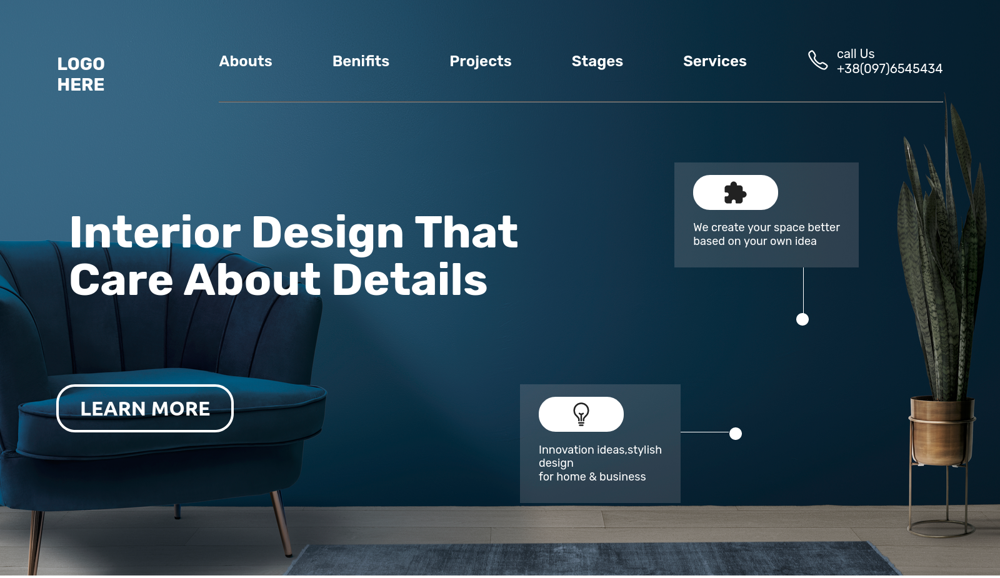
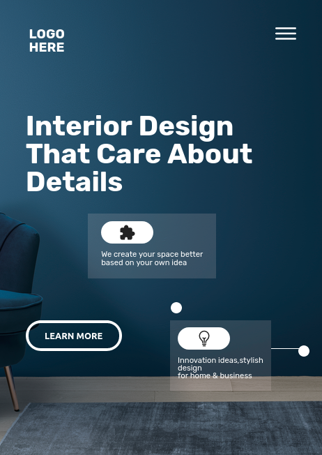

# PROJECT 10 - Interior design

This is the 10th reponsive project-challenge among the 15 Ineuron-projects.

## Table of contents

- [Overview](#overview)
  - [Screenshot](#screenshot)
  - [Links](#links)
- [My process](#my-process)
  - [Built with](#built-with)
  - [Time required](#time-required)
  - [What I learned](#continues-development)
  - [Useful resources](#useful-resources)
- [Author](#author)
- [Acknowledgments](#acknowledgments)

## Overview

### Screenshot





### Links

- Code File URL: [github.com](https://github.com/Jyotimoykathar/Project-02)
- Live Site URL: [netlify.app](https://project-02-restaurant.netlify.app/)

## My process

### Built with

- Semantic HTML5 markup
- CSS custom properties
- Flexbox Css
- Grid Css

### Time required

Nearly two day required only for making the cards and placing them, so overall it required 4 days.

### What I learned

This is the css design code snippet of card section using sudo classes after and before.

```css
.puzzle-card {
  display: inline-block;
  background-color: rgba(232, 213, 213, 0.16);
  padding: 2rem 3rem;
  text-align: left;
  color: #fff;
  margin-bottom: 2rem;
  position: relative;
  align-self: start;
}
.puzzle-card:before {
  content: "";
  position: absolute;
  top: 100%;
  right: 30%;
  height: 50%;
  width: 0.5px;
  background-color: #fff;
}
.puzzle-card:after {
  content: "";
  position: absolute;
  bottom: -55%;
  right: 27%;
  height: 2rem;
  width: 2rem;
  background-color: #fff;
  border-radius: 50%;
}
```

### Continued development

I still have a lot to learn about flexbox, Css Grid, seudo classes and and reponsivness using media queries. More interaction will be added using JavaScript and Custom Animations.

### Useful resources

- [MDN](https://developer.mozilla.org/en-US/) - This website helped me to any thing i had to look upon.
- [IONICON](https://ionic.io/ionicons) - This is an amazing website with open source icons which is easy to implement to your web pages.

## Author

- Github page- [Jyotimoykathar](https://github.com/Jyotimoykathar/)

## Acknowledgments

Special Thanks to Ineuron team for the responsive project-challenge to learn and improve my CSS flexbox, grid and sudo classes skills.
